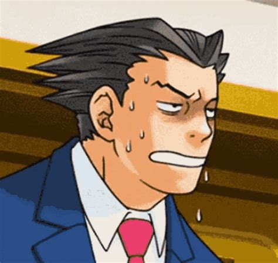
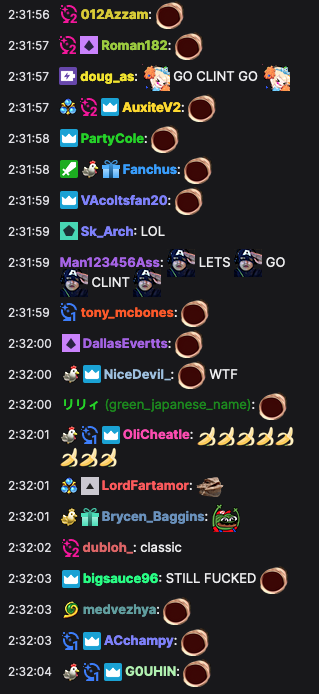

```{r setup, include=FALSE}
knitr::opts_chunk$set(echo = FALSE)
```

```{r library}
library(tidyverse)
library(plotly)
library(DT)
```

```{r readcsv}
tracks <- read_csv("../_data/track-abbr.csv")

results <- read_csv("../_data/stream-snipe.csv") %>% 
  left_join(tracks, by = "trk") %>% 
  select(race, Sarah, Clint, track, trk, cc, cup, type) %>% 
  filter(!is.na(Sarah)) %>% 
  mutate(race = row_number(race))
```

## Intro

A few weeks ago I sent Clint Stevens a friend request on the Switch with little expectation it would go anywhere. But I lucked out on Tuesday and got added.

::: {style="width:100%;height:0px;position:relative;padding-bottom:56.250%;"}
<iframe src="https://streamable.com/e/rw7kok?loop=0" frameborder="0" width="100%" height="100%" allowfullscreen style="width:100%;height:100%;position:absolute;left:0px;top:0px;overflow:hidden;">

</iframe>
:::

<aside>

{width="212"}

dang I should finish the third game

</aside>

<p>

</p>

I knew my online game was rusty---most of my \~7K Elo ranking was from spring 2018 or earlier (four years ago wtf). I picked the game back up recently but I've been doing no-item speedruns, which is good for practicing the maps and shortcuts but terrible for item management.

After the game I made a spreadsheet of which games I played in and the results for myself and Clint. I'd like to add other members of chat, but it's a bit tedious to go through the VOD and manually enter everyone's results.[^1]

[^1]: If anyone else wants to help collect this data, please let me know! (update: JK I did it the next day)

## Analysis

### All Races

In total, I was able to play in 39 races with Clint and the other members of chat, excluding two games where Clint left but myself and other snipers continued to play.

```{r racerResult}
racerResult <- results %>% 
  pivot_longer(cols = c(Sarah, Clint),
               names_to = "racer",
               values_to = "result")
```

The below graph shows how Clint and I placed in every race. The graph is interactive, so feel free to hover over any point to see more details. Clicking on a line in the legend will isolate it and hide the other line.

```{r, layout="l-page", fig.height=2}
ggResult <- racerResult %>% 
  ggplot(aes(x = race, y = result, color = racer)) +
  geom_line() +
  geom_point(aes(text = track)) +
  scale_y_reverse(breaks = seq(1, 13, by = 4)) +
  theme_minimal() +
  labs(title = "Mario Kart online worldwide races. March 8, 2022",
       x = "Race #",
       y = NULL,
       color = "Player")

ggplotly(ggResult)
```

Clint was able to snag twelve top-3 finishes (31%), including two wins. Unfortunately, I never broke 5th. Still, there were 10 races (26%) where I was able to come out ahead of him. I had five last place finishes (13%), he had three (8%).

To better understand how the results trended throughout the game, the below graph shows the same data as above but smoothed out.

```{r, layout="l-page", fig.height=6}
ggSmooth <- racerResult %>% ggplot(aes(x = race, y = result, color = racer, fill = racer)) +
  geom_smooth() +
  scale_y_reverse(breaks = seq(1, 13, by = 4)) +
  theme_light() +
  labs(x = "Race #",
       y = NULL,
       color = "Player",
       fill = NULL)

ggplotly(ggSmooth)
```

Clint's strong start dropped as snipers entered the lobby. He recovered from the lull, followed by a momentum swing which died out towards the end. His overall average was between 6th and 7th place. My results were mostly stagnant, averaging between 8th and 9th place.

Despite my poor results, I had one of the lowest Elo ratings in the lobby and consistently gained points. I entered with a 7010 and left with a 7208, a gain of 198 points.

### Map Frequency

Over the course of the 39 races, 25 unique tracks were played. The most frequently played tracks were Cheep Cheep Beach and Mario Circuit.

```{r}
trackPopular <- results %>% 
  count(track) %>% 
  arrange(desc(n)) 

datatable(trackPopular, 
          caption = "Most played tracks",
          options = list(pageLength = 5))
```

There were 23 tracks not played at all.

```{r}
notPlayed <- tracks %>% 
  anti_join(trackPopular, by = "track")

datatable(notPlayed, 
          caption = "Unplayed tracks",
          options = list(pageLength = 5))
```

### Best/Worst Tracks

What are each racer's best and worst tracks? The table below shows the average result for each racer on each map, along with the number of times they've played the map. Click in the boxes under the header row to easily filter for a particular player or track.

```{r, layout="l-page"}
racerTrack <- racerResult %>% 
  select(track, cc, racer, result) %>% 
  group_by(racer, track) %>% 
  summarise(avg = mean(result),
            plays = n()) %>% 
  arrange(racer, avg)

racerTrackF <- racerTrack %>%
  mutate(racer = as.factor(racer),
         track = as.factor(track)) 

racerTrackF %>% 
  datatable(filter = 'top', 
            caption = "Average track result for each racer",
            options = list(autoWidth = FALSE))
```

Clint's best tracks were Wild Woods, Electrodrome, and Wario's Gold Mine. His worst tracks were Mute City, Yoshi Circuit, and Sunshine Airport. My top tracks were Moo Moo Meadows and Royal Raceway. My worst tracks were Wild Woods, Donut Plains, and Animal Crossing (ironic considering my build).

Note that these best/worst rankings are subject to change as more games are played.

## Play of the Game

My favorite play was in the 30th race, just after the first lap of Cheep Cheep Beach. Clint was in first and I was in second. I noticed him slowing down and I saw the blue shell approaching just as I passed him. I said "oh hell no" and came to a stop so he was back in first and got hit.

::: {style="width:100%;height:0px;position:relative;padding-bottom:56.250%;"}
<iframe src="https://streamable.com/e/v6t3dp?loop=0" frameborder="0" width="100%" height="100%" allowfullscreen style="width:100%;height:100%;position:absolute;left:0px;top:0px;overflow:hidden;">

</iframe>
:::

<aside>

{width="172"}

</aside>

<p>

</p>

After reviewing the tape, the blue shell looks to be circling Clint before I slowed down, so I probably would've been safe if I continued on. (I also was too close and still got hit by the shell). Still, it was worth it for the laughs.

## Review & Goals

I suck compared to the other racers. It's hard to deny with the graphs in my face. But that's okay, I know I can get better.

The main reasons I suck at the moment are:

1\. Very little online experience the past four years. Despite knowing the maps well and confidently taking shortcuts, I am out of practice with items. Item lines are different than speedrunning lines. Too often I would miss items because I hugged a corner too close or I wasn't paying attention to the item being taken by the racer in front of me. Items are essential to good online play, so I really need to practice using them. It's also important to know when to use them; too often I would play overly defensive and not let go of items when I was far back in the pack.

2\. I never practice 200cc. I did not know how to brake drift and I routinely ran into walls or fell off the map.

3\. I play a non-meta build of full Animal Crossing: Isabelle, City Tripper, Leaf Tires, and Paper Glider.

I've already begun taking steps to improve. I watched some YouTube videos on item management and played for a few hours online Wednesday. I routinuely came in first, but I'm being placed in rooms significantly less competitive. But my Elo is rapidly increasing, so hopefully I'll start getting tougher rooms.

I also watched some videos on brake drifting and I've been going through the 200cc grand prix (which I'm surprised I never did before). I still don't enjoy 200cc, but I'm running into walls less often.

But I refuse to change my build. (update: JK I changed it two days later)
