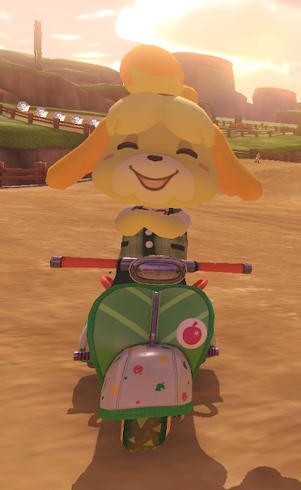
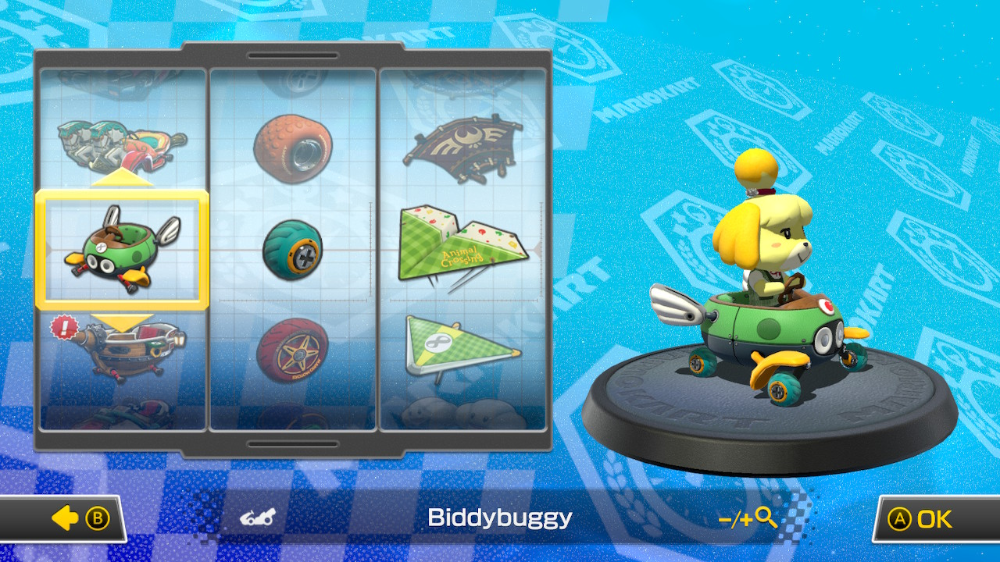
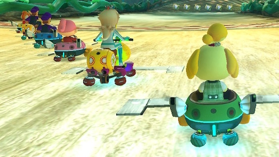
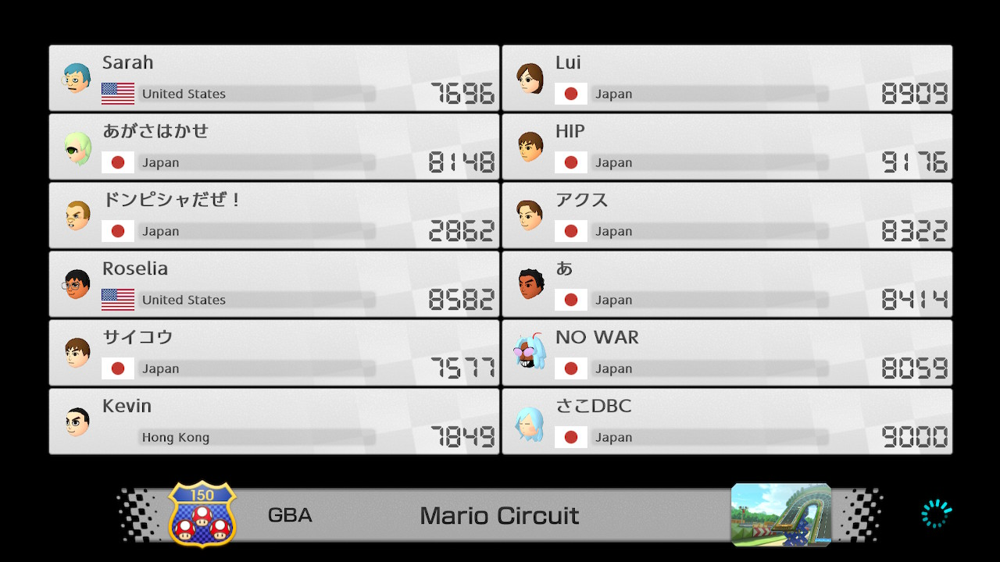

```{r setup, include=FALSE}
knitr::opts_chunk$set(echo = FALSE)
```

```{r}
library(tidyverse)
library(plotly)
library(DT)
library(lubridate)
```

```{r}
runs <- read_csv("../_data/sr-runs.csv")
online <- read_csv("../_data/online-play.csv")
```

## Overview

For years[^1] I have stuck with the same Mario Kart build: Isabelle, City Tripper, Leaf Tires, and Paper Glider. I know it's a sub-optimal build, but I wanted to max out my abilities with that cart before switching to a meta build.

[^1]: I use "years" loosely because I didn't play much from late 2018 till the beginning of this year. Grad school got in the way of Mario Kart.

<center>

{width="30%"}

</center>

Yesterday I decided to make the switch. It was not the first day I tried the Biddybuggy--that was Valentine's Day (where I set [16 PBs](https://sarah.fyi/mk/2022-02-tt/#day-of-month) in one day). I tried speedrunning that night, but I was struggling with turns on the new build and had a lot of falls, so I cut the run short. I switched back to the City Tripper and didn't think much of it.

Then my speedrun times began to leveled out and I embarrassed myself in online play, so I was ready to give the Biddybuggy another shot.



First I extensively practiced the time trials, and was setting PB after PB. I began getting a grasp of the biddybuggy handling. I knew if I tried the 48 track speedrun, I would set a fat personal best.

Around 11 PM I tried to stream the run on Twitch, but my internet was having issues and I was getting a lot of dropped frames.[^2] For the first time I decided to just record the speedrun locally and upload it to YouTube.

[^2]: I'm currently on my neighbor's internet and I'll have my own installed on March 28th, so that should cut down on streaming problems.

Once I started running, it quickly became obvious that my predictions were right. I had saved over half a minute before getting to the halfway point. The second half of the race had a handful of falls (future time saves) and I accidentally rigged the game to play the Animal Crossing winter track (notorious for horrible traction and adding excessive time). Still, I managed to easily PB by 48 seconds, an insane time save considering how many falls I had.

```{r}
srtime <- runs %>% 
  mutate(time = `Realtime (ms)`/1000) %>% 
  separate(time, into = c("seconds", "milli")) %>% 
  mutate(seconds = as.numeric(seconds),
         time = seconds_to_period(seconds),
         attempt = `Attempt #`) %>% 
  select(attempt, time)

ggSR <- srtime %>% 
  ggplot(aes(x=attempt, y=time)) +
  geom_line() +
  geom_point() +
  scale_y_time() +
  labs(x = "Attempt #",
       y = "Time",
       title = "Speedrun Attempts") +
  theme_minimal()

ggplotly(ggSR)
```

My reaction during the run was almost upset. Of course I was happy to PB, but I was frustrated for two reasons: 1. Why are two carts (Biddybuggy and Wiggler) sooo much better than other carts? 2. Why did I resist playing the meta for so long?[^3]

[^3]: Answer: I thought the City Tripper was cute and I liked committing to the bit of full Animal Crossing build.



Time after time there were sections where I normally would've run into a wall or object, but the Biddybuggy allowed me to safely navigate around obstacles. During Dry Dry Desert I decided to risk going underneath a Poke to grab a coin, an unnecessary risk. After successfully grabbing it, I said aloud, "This cart is just giving me a confidence I didn't know I was missing."

## The Run

After the run, I submitted my time to speedrun.com. At the time of writing this, I moved from 206th to 180th, an improvement of 26 spots. You can watch the full speedrun below.

::: {style="width:100%;height:0px;position:relative;padding-bottom:56.250%;"}
<iframe src="https://www.youtube.com/embed/pvTrImTUTDY" frameborder="0" allow="accelerometer; clipboard-write; encrypted-media; gyroscope; picture-in-picture" allowfullscreen style="width:100%;height:100%;position:absolute;left:0px;top:0px;overflow:hidden;">

</iframe>
:::

<p>

</p>

*Disclaimer*: I'd been awake for about 26-27 hours when I began the run. Be warned that since it was just me, I didn't talk much and I mumbled a lot. While the recorded video contains gameplay audio, I was listening to my own music during the run. If I seem like I'm talking to myself, I was mouthing along song lyrics. When I did talk, I was often cursing out my gameplay or wondering why certain songs weren't playing (problems with soundcloud).

### Future time saves

There are a handful of major time saves still available:

-   Neo Bowser City: one fall
-   (SNES) Rainbow Road: one fall on shortcut on second lap
-   Ice Ice Outpost: 3 falls - first lap landed too far right off first ramp, first and third lap final ramp cut in too late
-   Ribbon Road: 2 falls - missed second ramp on first and second lap
-   Animal Crossing: accidentally rigged for winter track

And some more minor time saves:

-   Donut Plains 3: botched shortcut
-   Super Bell Subway: ran into subway on second lap
-   Toad's Turnpike: ran into bus on 3rd lap
-   Music Park: botched final shortcut
-   Cheeseland: twice went slightly off road near second chomp chomp, hit a wall
-   Bone-Dry Dunes: ran into wall one turn

## Online Play

Today I practiced online with the biddybuggy. The room I was placed in was pretty well balanced, with nearly everyone's rating being between 7500-9000. The average rating going into the final game was 7882.



I kept track of my results, and I'm content with how I placed. The graph below shows my result for each of the 25 races.

```{r}
ggOL <- online %>% 
  ggplot(aes(x=race, y=result)) +
  geom_line() +
  geom_point() +
  scale_y_reverse(breaks = seq(1, 13, by = 4), limits = c(12, 1)) +
  theme_minimal() +
  labs(title = "Mario Kart online worldwide races. March 14, 2022",
       x = "Race #",
       y = "Result")

ggplotly(ggOL)
```

I landed in the top three 9 times (36%) and my lowest placement was 9th. My average result was 4.88. My rating at the end of the night was 7702.
