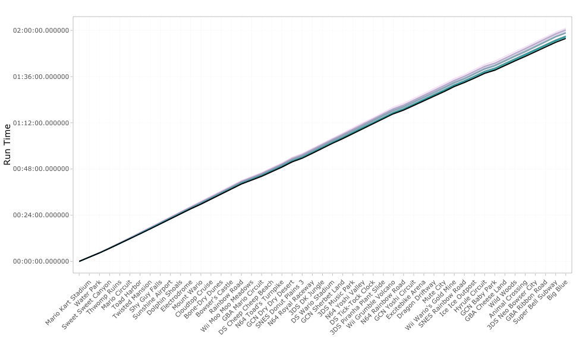
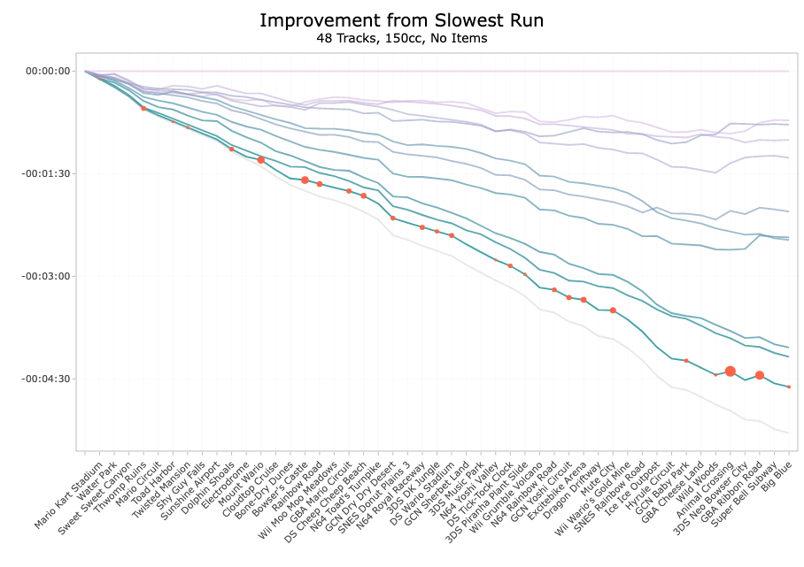
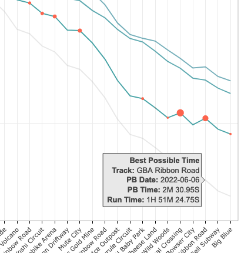
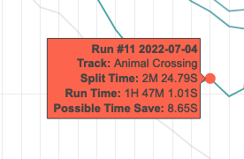
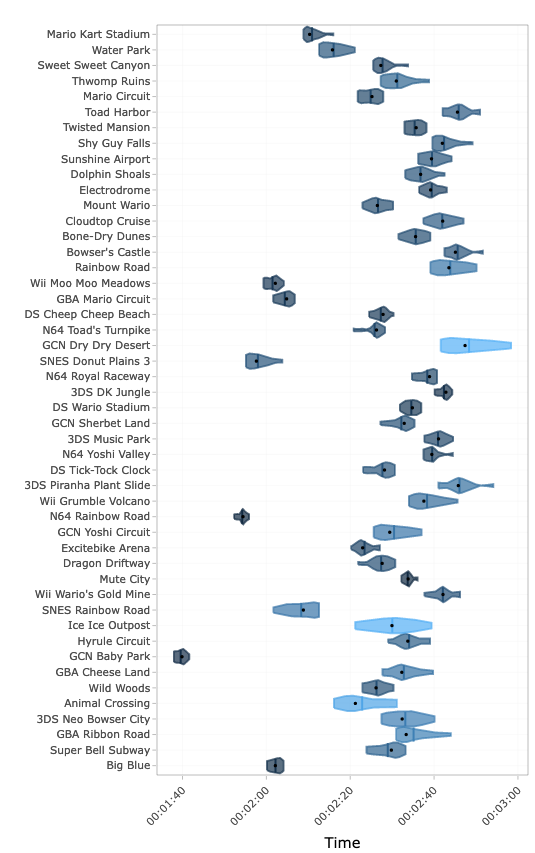
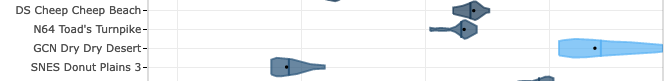

```{r include=FALSE}
knitr::opts_chunk$set(echo = FALSE)
```

## Credits

I would like to give a huge shoutout to [Héctor M. Sánchez C.](https://chipdelmal.github.io/) (chipdelmal), whose Mario Kart speedrunning graphs inspired the ones I created on my site. I was particularly inspired by the charts [here](https://chipdelmal.github.io/dataViz/2020-07-15-MK8D1.html), [here](https://chipdelmal.github.io/dataViz/2020-08-15-MK8D3.html), and [here](https://chipdelmal.github.io/dataViz/2021-01-15-MK8Dpypi.html). Additionally, his [MK8D Python package](https://pypi.org/project/MK8D/) is what I use to convert my speedrun splits into a csv file, which was essential to being able to create and automate my speedrunning dashboard. Go check out his blog, he's made a lot of awesome graphs with great, clear explanations.

This website was made with R in RStudio (soon to be renamed [posit](https://posit.co/)); each page originates from an RMarkdown file, which allows me to easily pull my most recent data and publish it as an interactive graph. I used the [flexdashboard](https://pkgs.rstudio.com/flexdashboard/index.html) package to create my dashboards; [tidyverse](https://www.tidyverse.org/) tools were essential to cleaning and organizing the data; [lubridate](https://lubridate.tidyverse.org/) made the time data pretty, [ggplot](https://ggplot2.tidyverse.org/) was use to make the graphs and [plotly](https://plotly.com/ggplot2/) makes them interactive. In the future I want to try converting my dashboards into interactive shiny dashboards.

------------------------------------------------------------------------

My Mario Kart [speedrun](https://sarah.fyi/sr.html) and [time trial](https://sarah.fyi/tt.html) dashboards have been a months-long passion project. I work full-time and don't have as much time to play as I'd like, so these graphs and tables allow me to focus on improving my weakest courses, rather than just replaying my favorite tracks. As the dashboards evolved into something I was proud of and wanted to share with my friends, they often had the same response: "I have no idea what I'm looking at."

lol, fair. The dashboards are meant to be a resource for myself to be updated regularly, which is why there is no narrative or explanation. I open up my dashboard when I open up Mario Kart, and I want to be able to refresh the data without rewriting a narrative. But I hope this page offers some help.

## Speedrunning

Speedrunning is playing a game as fast as possible. I speedrun Mario Kart, and my favorite is the 48 Track 150cc speedrun. In this run you play through all of the original 48 tracks nonstop, which takes about two hours. I also do track and cup runs where you play 16 and 4 tracks at a time, respectively, which allows me to train sections of the 48 track run.

## Line graph


The line graph is the most straightforward graph, and shows my total run time for each run. It's good at showing my overall progress over time.

## Traces Plot

I wanted to be able to graph each of my runs and see how they compare, specifically for each track. You might be wondering, "why don't you just put the tracks on one axis and your run time on the other?" Because the graph for a 48-track run would look like this:



The above graph answers the question, "When I'm on track X, for how long have I typically been running?" But we can't gather much else. My run time decreased by over four and a half minutes over a five month period, but this change isn't very noticeable over the course of a two-hour run. It's nearly impossible to see which on tracks I improved or faired worse.

It's easier to see this information if we center the runs around another piece of data. My preferred method is to see how each run compares to my slowest run. Instead of the x-axis indicating a run time of 0:00:00, we make the x-axis my slowest run.



Every line on the graph shows the difference in run duration between that run and my slowest run. This time difference, or offset, is significantly smaller, giving us more information on how my overall run times and specific tracks have changed over time.

```{r fig.align ="center", out.width="400px"}

```

The grey line shows my best possible time. It includes track times from runs that were ended early.

```{r fig.align ="center", out.width="275px"}

```

Orange Dots

## Violin Plot

Think of a violin plot like a fancy box and whisker plot. Each violin contains all the run data for a particular track. The point furthest to the left is my fastest time, furthest to the right is my slowest time, and all the other runs fall somewhere in the middle. The violin plot bulges depending on where most of those other runs fall.

```{r fig.align ="center", out.width="530px"}

```

Ideally, I want each plot to bulge towards the left side, meaning my runs are consistently fast. If a track bulges on the right, that means I might have had a fast run or two, but my times are typically slower. For instance, I have had some fast runs on Toad's Turnpike, but my times are mostly concentrated to the right, which tells me I typically run into at least one car on the track.

Additionally, the color of each violin signifies the standard deviation of the track compared to other tracks. The higher the standard deviation, the more my times have varied for that track. So my run times are consistent and close together on a track like Baby Park. Dry Dry Desert is a track I originally was very slow at running, but I've made large progress over the past few months so my times have significantly improved, and there's been a lot of variance in my track times.

```{r fig.align ="center", out.width="530px"}

```

The black dot on each violin shows my median track time. The center bar shows my average run time. The further to the left the dot is, the more consistent I am at running that track fast.
